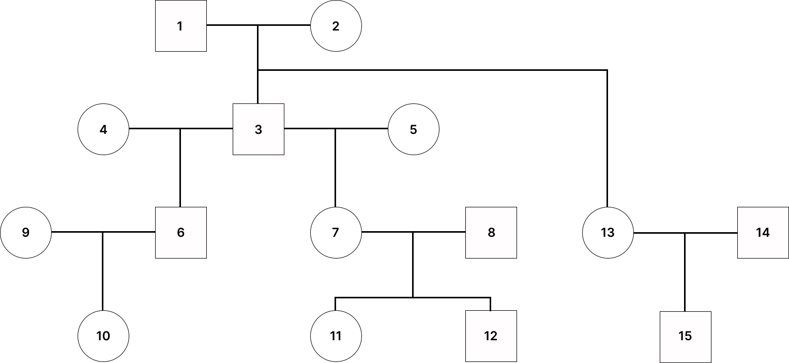
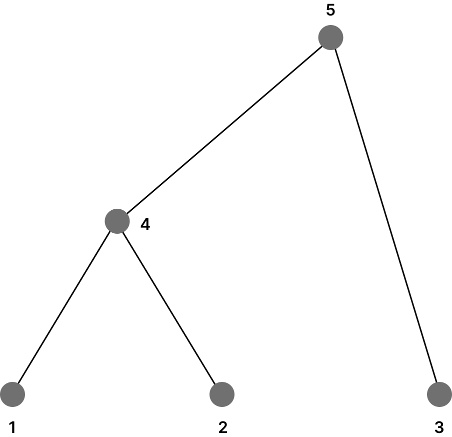

.. Sphinx documentation can be found here: https://www.sphinx-doc.org/en/master/index.html

================================================================================
Pedigree-ARG matching
================================================================================

This project addresses the alignment problem between a pedigree and an Ancestral Recombination Graph (ARG) that describes genetic transmissions within a given pedigree.

=====================================
Problem definition
=====================================

Specifically, given the following inputs:

1. **The Pedigree** :math:`P`;
2. **The ARG** :math:`A`: An ARG with a set of leaf vertices :math:`L`, representing genetic transmissions within :math:`P`;
3. **Initial Assignments**: A mapping :math:`f: V(L) \to 2^{P} \setminus \emptyset`, specifying initial relationships between ARG leaves and pedigree vertices,

the algorithm computes all possible **alignments** between :math:`A` and :math:`P`. An alignment is a function that assigns every vertex in the ARG to a vertex in the pedigree.

Formally, it is defined as :math:`h: V(A) \to 2^{P} \setminus \emptyset`.

In other words, the goal is to find valid extensions of the initial assignments provided as input.

================================
Installation
================================

To install:

1. Clone this repository.
2. In your local copy, open a terminal.
3. Run ``pip install .``.

================================
Running the alignment
================================

The most convenient way of running this software is by using the driver file.

--------------------------------
Driver file
--------------------------------

The driver file is a YAML file that specifies the input data in the following user-friendly format:

.. code-block:: yaml

   initial_assignments:
     - coalescent_id: 1
       pedigree_ids: [11P]
     - coalescent_id: 2
       pedigree_ids: [11M]
     - coalescent_id: 3
       pedigree_ids: [12P, 13M, 13P]
     - coalescent_id: 4
       pedigree_ids: [14M, 15P, 19M]
   coalescent_tree:
     path: "example_coalescent_tree"
     missing_parent_notation: "-1"
     separation_symbol: " "
     skip_first_line: false
   pedigree:
     path: "example_pedigree.pedigree"
     missing_parent_notation: "-1"
     separation_symbol: " "
     skip_first_line: false
   output_path: "example"

~~~~~~~~~~~~~~~~~~~~~~~~~~~~~~~~~~~~
Initial Assignments
~~~~~~~~~~~~~~~~~~~~~~~~~~~~~~~~~~~~

The ``initial_assignments`` field specifies the initial mapping for the leaf vertices in the coalescent tree. Each object in the list must include two fields: ``coalescent_id`` and ``pedigree_ids``.

- **coalescent_id**: Specifies the ID of the coalescent node in the tree.
- **pedigree_ids**: A list of values denoting the ploids in the pedigree to which the specified ``coalescent_id`` can be mapped.

Each ploid is represented by the pedigree ID followed by one of the two ploid types:
  - **P**: Represents the paternal ploid.
  - **M**: Represents the maternal ploid.

.. note::
   All leaf vertices, and only the leaf vertices, must have their initial mappings specified.

~~~~~~~~~~~~~~~~~~~~~~~~~~~~~~~~~~~~
Graph Parsing Rules
~~~~~~~~~~~~~~~~~~~~~~~~~~~~~~~~~~~~

The ``pedigree`` and ``coalescent_tree`` sections describe the parsing rules used by the program. The general structure is as follows:

.. code-block:: yaml

   graph_parsing_rules:
     path: "example_coalescent_tree"
     missing_parent_notation (optional): "-1"
     separation_symbol (optional): " "
     skip_first_line (optional): false

- **path**: Specifies the path to the file to be parsed.

The program resolves this path using the following logic:
  1. If the path is an absolute path or a valid relative path from the current working directory (CWD), the file is used directly.
  2. Otherwise, the program treats the path as relative to the driver file's location.

Once the file is located, the program checks for any user-specified parsing rules. Below are the customizable options:

- **missing_parent_notation**: The sequence of characters used to denote an unknown parent. The default value is ``"-1"``.
- **separation_symbol**: The sequence of characters used to separate the columns in the input file. The default value is ``" "``.
- **skip_first_line**: Indicates whether the first line in the file should be skipped. This can be useful when the file includes a header. The default value is ``false``.

^^^^^^^^^^^^^^^^^^^^^^^^^^^^^^^^^^^
Pedigree Parsing Logic
^^^^^^^^^^^^^^^^^^^^^^^^^^^^^^^^^^^

The algorithm maps coalescent vertices to pedigree **ploids** by generating ploid IDs for every individual in the pedigree.

""""""""""""""""""""""""""""
Ploid ID Calculation
""""""""""""""""""""""""""""

For each pedigree individual with ID ``n``, the corresponding pedigree ploid IDs are:

- ``2 * n`` → Paternal ploid
- ``2 * n + 1`` → Maternal ploid

To retrieve the individual ID and ploid parent type from a given ploid ID ``m``:

- Individual ID: ``m // 2``
- Parent Type: ``m % 2`` (``0`` for paternal, ``1`` for maternal)

---------------------------------------------------------------

""""""""""""""""""""""""""""""
Pedigree File Structure
""""""""""""""""""""""""""""""

When parsing the pedigree file, the program assumes the following column structure:

- **First column** → Child ID
- **Second column** → Father ID
- **Third column** → Mother ID

Any additional columns in the file are ignored.

---------------------------------------------------------------

"""""""""""""""""""""""""""""""
Example Input File
"""""""""""""""""""""""""""""""

.. code-block:: text

   # id parent0 parent1
   0;;
   1;;2
   2;3;;
   3;4;5

To parse this file, use the following YAML configuration:

.. code-block:: yaml

   pedigree:
     path: "example_pedigree_path"
     missing_parent_notation: ""
     separation_symbol: ";"
     skip_first_line: true

~~~~~~~~~~~~~~~~~~~~~~~~~~~~~~~~~~~~
Output
~~~~~~~~~~~~~~~~~~~~~~~~~~~~~~~~~~~~

The ``output_path`` field specifies where the results of the alignment should be stored.

---------------------------------------------------------------

As you can see, the driver file allows us to specify all the required input for the algorithm, as specified in
the Problem statement, in a customizable and a user-friendly way.

--------------------------------
Running the alignment script
--------------------------------

You can now use the driver file that you've created by running the ``scripts/driver_file/run_driver_file.py``. You can
either run the script without any arguments and get prompted by the program, or use the ``-f`` flag for specifying
the driver file's location.

~~~~~~~~~~~~~~~~~~~~~~~~~~~~~~~~~~~~
Example
~~~~~~~~~~~~~~~~~~~~~~~~~~~~~~~~~~~~

The repository contains one small example for you to get started under ``scripts/driver_file/example`` which contains
a small pedigree, a coalescent tree and the driver file. The input graphs are depicted below:

   Example pedigree

--------------------------------------------

   Example coalescent tree

The initial mapping is given as follows:

- ``1`` can be mapped to any ploid of ``10`` and ``11``.
- ``2`` can be mapped to any ploid of ``12``.
- ``3`` can be mapped to any ploid of ``15``.

After running the script, you should get 8 valid alignments in the end. You can run the example by installing the
library and running the following command from the root directory:

.. code-block:: bash

   python scripts/driver_file/run_driver_file.py -f "scripts/driver_file/example/driver_file.yaml"

--------------------------------
Output format
--------------------------------

The algorithm saves the alignment results in the directory specified by ``output_path``.
For every clade in the coalescent tree, a separate folder will be created, named after the clade root's ID.

Inside each clade folder:

1. **Alignment Files**:

   - The folder will contain a set of alignment files, where each file represents a distinct alignment.

   - Two alignments are considered distinct if there is at least one coalescent vertex that is mapped differently.

   - Each alignment file will be named as ``alignment_{id}``, where ``{id}`` is a sequential counter identifying the alignment.

2. **Statistics File**:

   - A file named ``clade_{root_id}`` will also be included. This file aggregates the data and provides statistical insights about the alignments.

.. note:: **No Alignments**

    If no alignments are generated, it indicates that the input data contains errors, and no solutions exist for the given input.

.. note:: **Alignment Similarity**

    A high number of alignments does not necessarily mean high variability. Many alignments might be very similar.
    To evaluate the true diversity of alignments, refer to the statistics file, which provides the number of
    possibilities for each coalescent vertex.

~~~~~~~~~~~~~~~~~~~~~~~~~~~~~~~~~~~~
Alignment Format
~~~~~~~~~~~~~~~~~~~~~~~~~~~~~~~~~~~~

Each alignment result is stored as a separate plain text file with a simple structure.
The file consists of two sections:

1. **Statistical Data** – A block containing relevant statistics.
2. **Alignment Data** – A mapping of coalescent vertex IDs to pedigree ploid IDs.

The alignment data follows the format ``{coalescent_vertex_id}: {pedigree_ploid_id}``

- **coalescent_vertex_id** – The coalescent vertex ID.
- **pedigree_ploid_id** – The ploid ID to which the coalescent vertex is mapped.

For details on how pedigree ploid IDs are generated, refer to the :ref:`Ploid ID Calculation`.

**Example File Structure:**

.. code-block:: text

    // Statistical data
    ...
    // Alignment
    48273217: 48273232
    48951023: 48951022
    99796362: 99796362
    48087661: 48087661
    98415561: 98415561
    99897771: 99897771
    48863718: 48863718
    99744483: 99744483
    99326428: 99326428
    48531357: 48531356
    99551936: 99551936
    100237346: 100237346

.. toctree::
   :maxdepth: 2
   :caption: Contents:

   simulating_errors
   error_alignments
   api